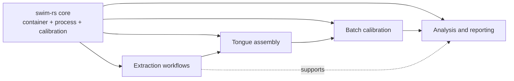

# swim-mtdnrc

<!--docs-index-start-->

Project workflows and analyses for Montana DNRC built on top of `swim-rs`.

`swim-rs` is the core framework: container schema, process engine, extraction
primitives, calibration machinery, and reporting. `swim-mtdnrc` is the
project-layer repo that assembles those capabilities into Montana DNRC-specific
work products such as statewide SID extraction, Tongue data assembly, batch
calibration, and post-calibration analysis.

This repo should be read as a workflow repository, not as a standalone
framework.

## Scope

The current codebase covers five workstreams:

- SID and state-scale extraction utilities
- Tongue data assembly and container preparation
- Tongue batch calibration and post-calibration restart state
- Tongue NDVI clustering and crop-curve analysis
- Tongue regression and streamflow context analysis



## Repository Map

- `src/swim_mtdnrc/extraction` - Earth Engine and remote-sensing extraction workflows
- `src/swim_mtdnrc/calibration` - crosswalks, merges, container build, batch calibration
- `src/swim_mtdnrc/clustering` - NDVI clustering, crop curves, CDL cross-tabs
- `src/swim_mtdnrc/analysis` - streamflow download and regression analysis
- `scripts/` - thin CLI wrappers for the main workflows
- `docs/` - collaborator-facing project documentation
- `notes/` - internal planning and working notes, not public docs

<!--docs-index-end-->

## Docs

The hosted docs are intended to mirror the workflow used in `swim-rs`, but with
project-specific content and a separate visual identity.

Start here:

- [Docs Home](docs/index.md)
- [Repo Organization](docs/repo-organization.md)
- [Data Assets](docs/data-assets.md)
- [SID Extraction Workflow](docs/workflows/sid-extraction.md)
- [Tongue Data Assembly Workflow](docs/workflows/tongue-data-assembly.md)
- [Tongue Calibration Workflow](docs/workflows/tongue-calibration.md)
- [Tongue Clustering and Analysis](docs/workflows/tongue-clustering-analysis.md)
- [Entry Points](docs/reference/entry-points.md)
- [Known Issues](docs/reference/known-issues.md)

## Getting Started

This repo uses `uv`.

```bash
uv sync --all-extras
```

Common entry points:

```bash
uv run python /home/dgketchum/code/swim-mtdnrc/scripts/run_crosswalk.py
uv run python /home/dgketchum/code/swim-mtdnrc/scripts/run_assemble_sid.py
uv run python /home/dgketchum/code/swim-mtdnrc/scripts/run_calibration.py --action status
uv run python /home/dgketchum/code/swim-mtdnrc/scripts/run_clustering.py --help
```

For direct module entry points that do not have a wrapper script, use:

```bash
uv run python -m swim_mtdnrc.calibration.build_container --help
```

## Collaboration Notes

- Do not treat this repo as a replacement for `swim-rs` docs.
- Use the workflow docs first, then inspect code as needed.
- Notebooks are planned as guided demonstrations of the Tongue workflow and
  calibrated deliverables.
