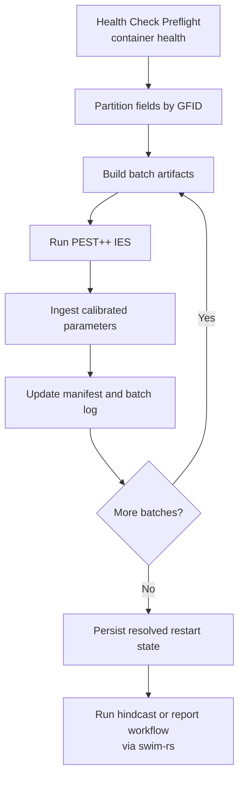

# Tongue Calibration

## Purpose

This workflow calibrates the Tongue container in field batches, persists the
calibrated parameters back into the container, and records the metadata needed
to resume work with forward-run containters for hindcast/forecast simulation,
or hand the container to collaborators.

## Batch Calibration Pipeline



## Primary Entry Points

| Entry point | Purpose |
|-------------|---------|
| `uv run python /home/dgketchum/code/swim-mtdnrc/scripts/run_calibration.py --action prep` | create batch manifest |
| `uv run python /home/dgketchum/code/swim-mtdnrc/scripts/run_calibration.py --action calibrate-all ...` | full pipelined calibration |
| `uv run python /home/dgketchum/code/swim-mtdnrc/scripts/run_calibration.py --action status` | inspect calibration state |
| `uv run python /home/dgketchum/code/swim-mtdnrc/scripts/run_calibration.py --action ingest-all` | ingest completed batch results |
| `uv run python /home/dgketchum/code/swim-mtdnrc/scripts/run_calibration.py --action plot-phi` | inspect phi history if available |

## What The Workflow Does

### 1. Preflight gate

`preflight_gate()` opens the container, reads the project config, and runs the
container health report using the calibration profile. Calibration is supposed
to stop on failures unless explicitly overridden.

### 2. Partition fields

`partition_fields_by_gfid()` groups fields by grid cell and packs them into
batch-sized work units. This becomes `batch_manifest.csv`.

### 3. Build batch artifacts

`build_batch()` and related helpers create the PEST++ batch directories and
builder outputs for one batch at a time.

### 4. Run PEST++

`run_batch()` delegates the actual inversion run to `swim-rs` PEST execution
helpers. `calibrate-all` overlaps the next build with the current run when
possible.

### 5. Ingest calibrated parameters

`ingest_batch()` writes the selected batch summary statistics back into the
container and records calibration metadata.

### 6. Persist resolved restart state

Once all manifest batches are ingested,
`persist_calibration_resolved_state()` writes a canonical post-calibration
restart run into the container so downstream work can reopen a stable
calibrated state.

## Main Artifacts

| Artifact | Role |
|----------|------|
| `batch_manifest.csv` | field-to-batch mapping |
| `batch_log.json` | resumable batch state |
| `run_manifest.json` | calibration run metadata and gate outcome |
| health report directory | pre-calibration readiness check |
| calibration report artifacts | parameter summaries and QC flags |
| calibrated `.swim` container | main collaborator handoff artifact |

## Forward Pass And Hindcast Context

The forward pass after calibration is not driven by a dedicated
`swim-mtdnrc` CLI. The intended flow is:

1. build and calibrate the Tongue container in this repo
2. persist the resolved restart state in the container
3. use `swim-rs` tools or APIs against that calibrated container to run a
   hindcast or equivalent evaluation pass
4. generate the relevant reports from the calibrated container state

For collaborator docs, the important point is that calibration is the gate into
that downstream reporting workflow, not the end of the story.

## What Collaborators Should Inspect

For a calibrated Tongue delivery, collaborators should be able to locate:

- the calibrated container path
- the latest health report
- the calibration report artifacts
- the run manifest and batch log
- the default restart or resolved-state metadata in the container

## Notebook Demos

Use these only after reading this workflow page:

- [02 Tongue Calibration Artifacts](../notebooks/02_tongue_calibration_artifacts.ipynb)
- [03 Tongue Field Trace](../notebooks/03_tongue_field_trace.ipynb)

## Missing Data and SID County Containers

This pipeline also drives calibration for SID county containers, not just the
Tongue River project. Two important differences from the Tongue setup require
attention.

### No GFID column

The Tongue shapefile has a `GFID` column linking each field to its GridMET
grid cell. `partition_fields_by_gfid` uses this to keep spatially adjacent
fields (same met forcing) in the same batch.

SID county shapefiles do not have a `GFID` column (GridMET data is not yet
part of the county containers). When the column is absent the partitioner
falls back to simple sequential packing by FID order. No special flag is
needed — detection is automatic. If GridMET is later added and a GFID column
is introduced, pass `--gfid-column GFID` (or whatever the column name is) to
restore grouped packing.

### Fields with zero remote-sensing coverage

Some fields in every county have all-NaN NDVI and ETf time series across all
extracted years. These are present in the bucket CSVs but never yielded a
valid Landsat pixel — typically because the field falls on a scene boundary,
is consistently cloud-masked, or has `inv_irr`-only coverage that was not
ingested.

**What happens if you don't exclude them:** they will pass partitioning,
enter a batch, fail during the PEST++ spinup with a NaN state error, get
dropped by the build retry, and appear in `batch_log.json` as
`"dropped_fids"`. The pipeline continues — no data is lost — but the noise
and the per-batch retry cost are avoidable.

**Recommended approach for county containers:**

```bash
# Inspect first
python -m swim_mtdnrc.calibration.batch_calibrate \
    --action prep \
    --container /path/to/county.swim \
    --shapefile /path/to/sid_NNN.shp \
    --output /path/to/pestrun \
    --exclude-uncovered

# Then run — manifest is already filtered, --exclude-uncovered is a no-op
python -m swim_mtdnrc.calibration.batch_calibrate \
    --action calibrate-all \
    --container /path/to/county.swim \
    --shapefile /path/to/sid_NNN.shp \
    --output /path/to/pestrun \
    --override \
    --exclude-uncovered
```

`--exclude-uncovered` scans the container for fields with zero observations
in both `irr` and `inv_irr` for NDVI and ETf (union). Excluded FIDs are
written to `excluded_fids.json` alongside `batch_manifest.csv` as an audit
trail. If a manifest already exists it is used as-is; the scan only runs when
the manifest is being created for the first time.

To exclude additional fields manually, put their FIDs one-per-line in a text
file and pass `--skip-fids /path/to/skip.txt`. This can be combined with
`--exclude-uncovered`.

**Why `--override` is still needed:** fields with zero coverage in `irr` but
non-zero coverage in `inv_irr` satisfy the container health policy (union
check passes). Fields with zero coverage in *both* masks fail the policy. If
all such fields are excluded via `--exclude-uncovered`, the only remaining
health FAIL is usually the `lat/lon` check, which is a false alarm for
GIS-derived containers (coordinates come from the shapefile geometry, not a
CSV). Pass `--override` to log and proceed past that.

## Caveats

- Batch outputs are intermediate products; the container is the durable handoff.
- Resume behavior depends on the manifest and batch log being preserved.
- Health-check status should be treated as part of run provenance, not as a
  disposable side artifact.
- `excluded_fids.json` is part of the run provenance: preserve it alongside
  the manifest so the exclusion decision is auditable.
