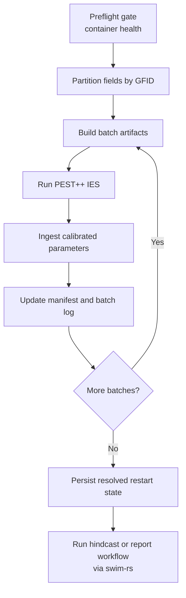

# Tongue Calibration

## Purpose

This workflow calibrates the Tongue container in field batches, persists the
calibrated parameters back into the container, and records the metadata needed
to resume work or hand the container to collaborators.

## Batch Calibration Pipeline

## When To Use This Workflow

Use this workflow when:

- the Tongue container has been built and passed health checks
- you need calibrated field parameters in the container
- you need resumable batch orchestration around PEST++
- you need a collaborator-facing calibrated container rather than loose batch outputs

## Primary Entry Points

| Entry point | Purpose |
|-------------|---------|
| `uv run python /home/dgketchum/code/swim-mtdnrc/scripts/run_calibration.py --action prep` | create batch manifest |
| `uv run python /home/dgketchum/code/swim-mtdnrc/scripts/run_calibration.py --action calibrate-all ...` | full pipelined calibration |
| `uv run python /home/dgketchum/code/swim-mtdnrc/scripts/run_calibration.py --action status` | inspect calibration state |
| `uv run python /home/dgketchum/code/swim-mtdnrc/scripts/run_calibration.py --action ingest-all` | ingest completed batch results |
| `uv run python /home/dgketchum/code/swim-mtdnrc/scripts/run_calibration.py --action plot-phi` | inspect phi history if available |

## What The Workflow Does

### 1. Preflight gate

`preflight_gate()` opens the container, reads the project config, and runs the
container health report using the calibration profile. Calibration is supposed
to stop on failures unless explicitly overridden.

### 2. Partition fields

`partition_fields_by_gfid()` groups fields by grid cell and packs them into
batch-sized work units. This becomes `batch_manifest.csv`.

### 3. Build batch artifacts

`build_batch()` and related helpers create the PEST++ batch directories and
builder outputs for one batch at a time.

### 4. Run PEST++

`run_batch()` delegates the actual inversion run to `swim-rs` PEST execution
helpers. `calibrate-all` overlaps the next build with the current run when
possible.

### 5. Ingest calibrated parameters

`ingest_batch()` writes the selected batch summary statistics back into the
container and records calibration metadata.

### 6. Persist resolved restart state

Once all manifest batches are ingested,
`persist_calibration_resolved_state()` writes a canonical post-calibration
restart run into the container so downstream work can reopen a stable
calibrated state.

## Main Artifacts

| Artifact | Role |
|----------|------|
| `batch_manifest.csv` | field-to-batch mapping |
| `batch_log.json` | resumable batch state |
| `run_manifest.json` | calibration run metadata and gate outcome |
| health report directory | pre-calibration readiness check |
| calibration report artifacts | parameter summaries and QC flags |
| calibrated `.swim` container | main collaborator handoff artifact |

## Forward Pass And Hindcast Context

The forward pass after calibration is not driven by a dedicated
`swim-mtdnrc` CLI. The intended flow is:

1. build and calibrate the Tongue container in this repo
2. persist the resolved restart state in the container
3. use `swim-rs` tools or APIs against that calibrated container to run a
   hindcast or equivalent evaluation pass
4. generate the relevant reports from the calibrated container state

For collaborator docs, the important point is that calibration is the gate into
that downstream reporting workflow, not the end of the story.

## What Collaborators Should Inspect

For a calibrated Tongue delivery, collaborators should be able to locate:

- the calibrated container path
- the latest health report
- the calibration report artifacts
- the run manifest and batch log
- the default restart or resolved-state metadata in the container

## Caveats

- Batch outputs are intermediate products; the container is the durable handoff.
- Resume behavior depends on the manifest and batch log being preserved.
- Health-check status should be treated as part of run provenance, not as a
  disposable side artifact.
