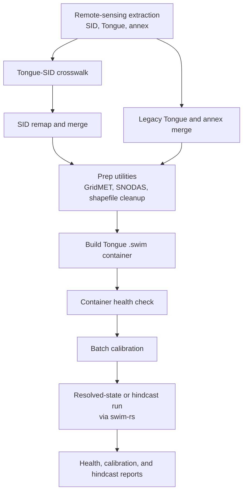

# Tongue Data Assembly

## Purpose

This workflow turns upstream Tongue, annex, and SID extractions into a coherent
Tongue project dataset and then builds a SWIM container suitable for
calibration, hindcast evaluation, and collaborator handoff.

## End-To-End Operational Flow

## When To Use This Workflow

Use this workflow when you need to:

- reconcile Tongue fields against SID identifiers
- merge legacy and SID-era extracts into one Tongue dataset
- prepare Tongue inputs for container ingest
- build or rebuild the Tongue `.swim` container

## Primary Entry Points

| Entry point | Purpose |
|-------------|---------|
| `uv run python /home/dgketchum/code/swim-mtdnrc/scripts/run_crosswalk.py` | build Tongue-SID crosswalk |
| `uv run python /home/dgketchum/code/swim-mtdnrc/scripts/run_assemble_sid.py` | remap and merge SID ETf and NDVI to Tongue IDs |
| `uv run python /home/dgketchum/code/swim-mtdnrc/scripts/run_merge_legacy.py` | merge legacy Tongue and annex extracts |
| `uv run python -m swim_mtdnrc.calibration.prep_inputs ...` | cleanup and conversion helpers |
| `uv run python -m swim_mtdnrc.calibration.build_container ...` | build or update the Tongue container |

## Workflow Steps

### 1. Build the Tongue-SID crosswalk

`swim_mtdnrc.calibration.crosswalk` creates the authoritative link between:

- Tongue integer `FID`
- SID string `sid_fid`
- county partition metadata

This step is what makes SID-derived extractions usable in the Tongue workflow.

### 2. Assemble SID-derived Tongue extracts

`swim_mtdnrc.calibration.assemble_sid`:

- downloads staged SID exports from GCS
- filters to accepted crosswalk matches
- remaps SID IDs to Tongue integer FIDs
- writes Tongue-oriented annual CSVs in the ingest layout expected by the container

### 3. Merge legacy Tongue sources

`swim_mtdnrc.calibration.merge_legacy` handles:

- NDVI overlap between legacy and SID-era sources
- WY chunk ETf merges
- chunked 2025 NDVI merges

This is the bridge between older Tongue material and the newer merged output
tree under `/nas/swim/examples/tongue_new/`.

### 4. Run prep utilities

`swim_mtdnrc.calibration.prep_inputs` contains local transforms that make
upstream files container-ready, including:

- shapefile deduplication
- GridMET parquet normalization
- SNODAS JSON-to-CSV conversion
- GridMET extension for the full project range

### 5. Build the container

`swim_mtdnrc.calibration.build_container` creates and populates the Tongue
`.swim` container by ingesting:

- GridMET
- NDVI
- ETf by model and mask
- SNODAS
- project properties

It then computes merged NDVI and irrigation-aware dynamics.

### 6. Run the health check

The build workflow runs a container health report as the final step unless
explicitly skipped. That report is the gate into calibration.

## Main Outputs

| Output | Role |
|--------|------|
| Tongue-SID crosswalk CSV | authoritative ID reconciliation |
| merged extract CSV trees | container-ready Tongue inputs |
| normalized GridMET and SNODAS files | container ingest inputs |
| Tongue `.swim` container | primary model and collaborator artifact |
| health report artifacts | readiness check for calibration and downstream use |

## Relationship To Hindcast And Reporting

This workflow stops at a healthy container. Hindcast or resolved-state forward
runs happen after calibration, typically using `swim-rs` against the calibrated
container rather than a dedicated `swim-mtdnrc` wrapper command.

## Caveats

- Multiple data trees are involved; path drift between `tongue`, `tongue_annex`,
  and `tongue_new` should be documented whenever a run is repeated.
- The crosswalk is a true dependency, not a convenience.
- Build success is not enough; the health report is the actual handoff gate.
